# Procura Usage Guide

This guide documents the demo data and screenshots generated by the automation script. Each section walks through a feature step-by-step so it can be used directly in the in-app Help view.

## Demo accounts
- Admin: admin.demo@procura.io / ProcuraAdmin!23
- Procurement: procurement.demo@procura.io / ProcuraBuy!23
- Approver: approver.demo@procura.io / ProcuraApprove!23
- Employee: employee.demo@procura.io / ProcuraEmployee!23
_Note: Demo accounts exist only if demo data was seeded._

## Table of contents
1. [Getting started](#getting-started)
2. [Home + navigation](#home--navigation)
3. [BOM workflow](#bom-workflow)
4. [Templates](#templates)
5. [Catalog](#catalog)
6. [Signoff + approvals](#signoff--approvals)
7. [Procurement actions](#procurement-actions)
8. [Purchase orders](#purchase-orders)
9. [Assets](#assets)
10. [Partners + transfers](#partners--transfers)
11. [Bills](#bills)
12. [Attachments](#attachments)
13. [Search history](#search-history)
14. [Audit log](#audit-log)
15. [Notifications](#notifications)
16. [Help guide and tutorial](#help-guide-and-tutorial)
17. [Feedback](#feedback)
18. [Profile + admin](#profile--admin)

## Getting started
### Register a new account
1. Open the registration screen.
2. Enter your email, password, and name.
3. Submit to receive an activation email.

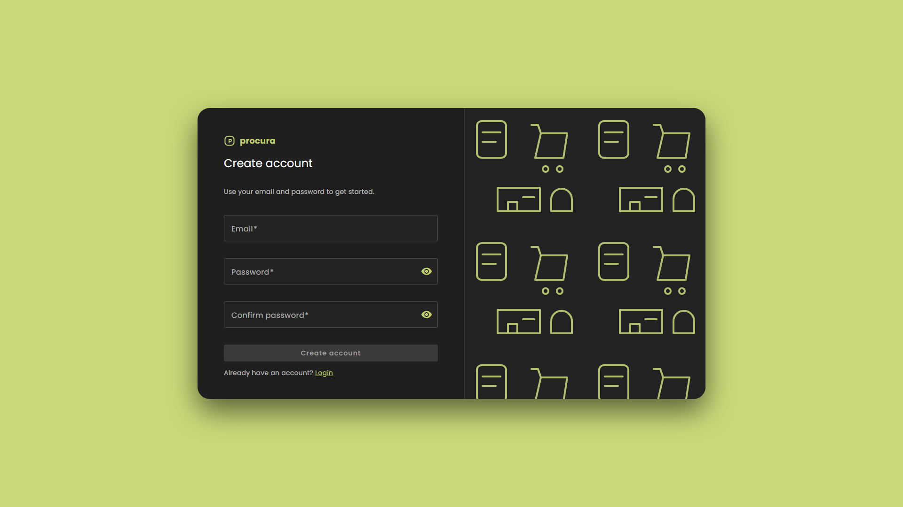

### Activate your account
1. Open the activation link from the email.
2. You will see a success message when activation completes.
3. Return to Login and sign in.

_Note: The screenshot uses a placeholder link; with a valid email link the message will show 'Account activated successfully.'_

### Sign in
1. Open the login screen and sign in with one of the demo accounts.
2. Use **Forgot password** if you need to reset credentials.

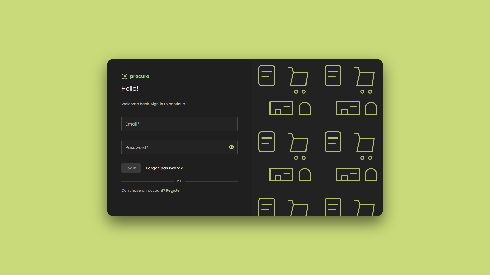

### Reset password
1. Open the reset request screen and enter your email.
2. Use the email link to open the reset form.
3. Set the new password and log in again.

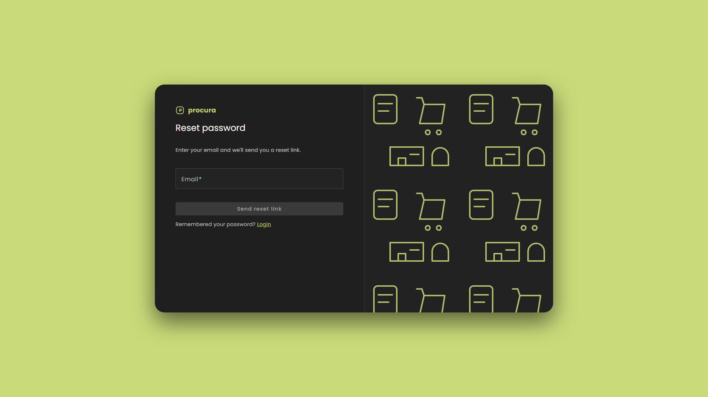
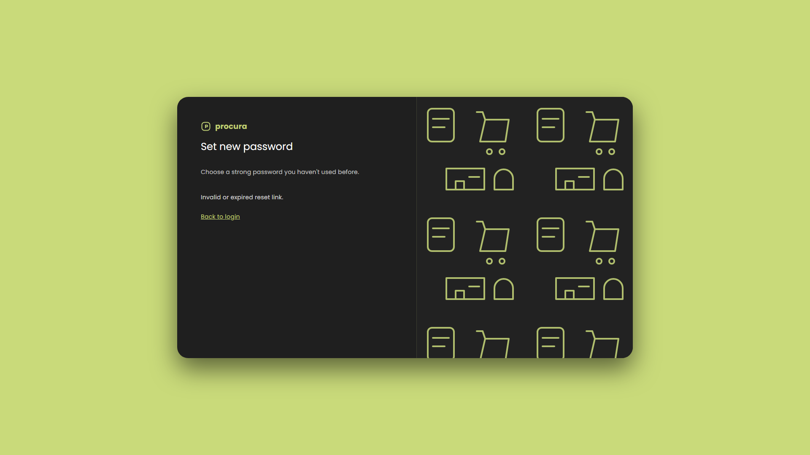

## Home + navigation
1. Use the left nav to jump between modules.
2. The top-right bell shows notification count and opens in-app notifications.
3. The floating Feedback button opens the feedback panel.

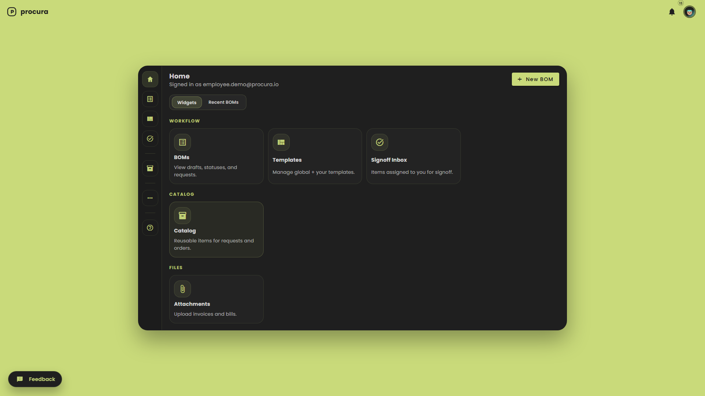

## BOM workflow
### 1) List and filter BOMs
1. Open **BOMs** in the nav.
2. Use the search field to filter by title or project.
3. Use status/date filters to narrow results and page controls to navigate.

### 2) Create a new BOM
1. Click **New BOM**.
2. Select a template (if available) to auto-generate dynamic fields.
3. Fill out the BOM details and item list, then save.
4. Use **Select from Catalog** to prefill BOM item fields from a saved catalog item.

### 3) BOM detail, collaborators, and export
1. Open a BOM to view items and status.
2. Use **Collaborators** to add/remove editors (they can request approvals).
3. Use **Download** to export PDF/CSV/JSON.
_Note: Collaborators can edit only while the BOM is DRAFT or NEEDS_CHANGES. Collaborators can remove themselves._

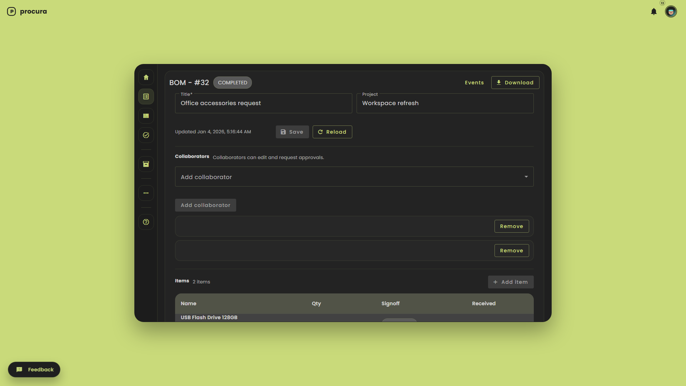

## Templates
1. Visit **BOM Templates** to view global and personal templates.
2. Click **View** to open the schema preview with real sample data.
3. Editing a global template creates a personal copy automatically.

## Catalog
1. Open **Catalog** to manage reusable items.
2. Search by keyword, category, or vendor.
3. Use **Edit** to update items or **Delete** to remove them.

## Signoff + approvals
### Signoff inbox (any role)
1. Signoff inbox is for any user assigned as a signoff assignee (any role).
2. Open **Signoff Inbox** to see assigned items.
3. Approve or request changes per item.

### Procurement approvals (Approver role)
1. Open **Approvals** to review BOM approvals.
2. Approve or request changes to advance the workflow.
_Note: All approvers must approve; a 'Needs Changes' decision resets the workflow._

## Procurement actions
_Note: Visible only to users with the procurement role._
1. Procurement users open **Procurement Actions** to track ordering and receiving.
2. Mark BOMs ordered and receive items as they arrive.

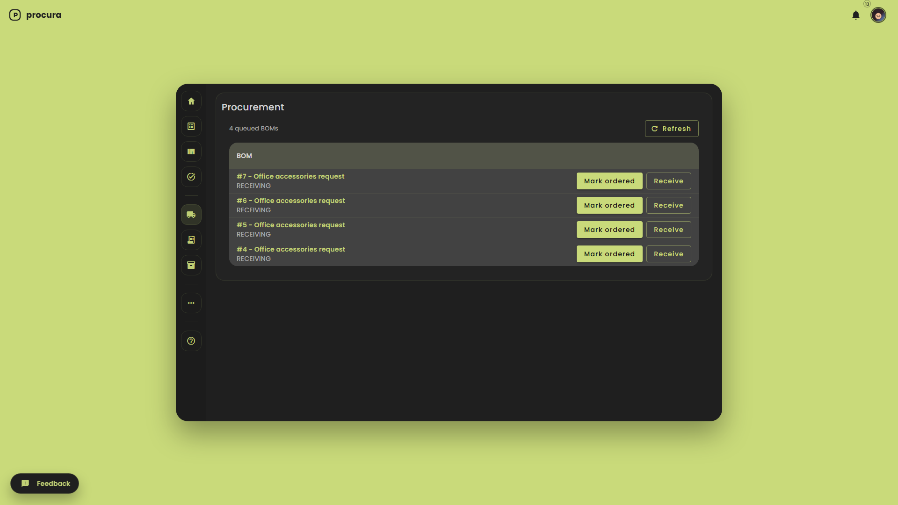

## Purchase orders
_Note: Visible only to users with the procurement role._
1. Open **Purchase Orders** and filter by vendor or BOM ID.
2. Click **View** to open an order and review line items.
3. Use the detail view to record receiving.

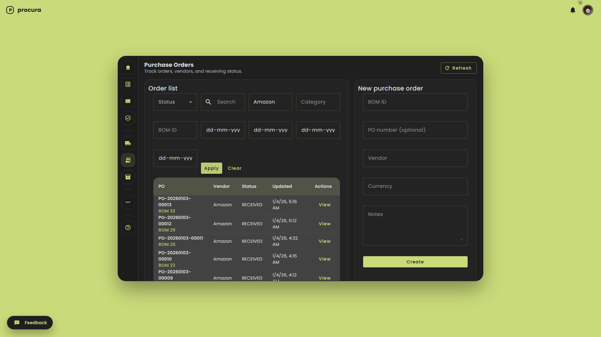

## Assets
_Note: Visible only to users with the procurement role._
1. Assets are auto-created when BOM/PO items are fully received.
2. Procurement can edit asset fields as needed.

## Partners + transfers
_Note: Visible only to users with the procurement role._
1. Create or manage partners under **Partners**.
2. Use **Transfers** to move assets between partners.
3. Open a transfer to see line items and status updates.

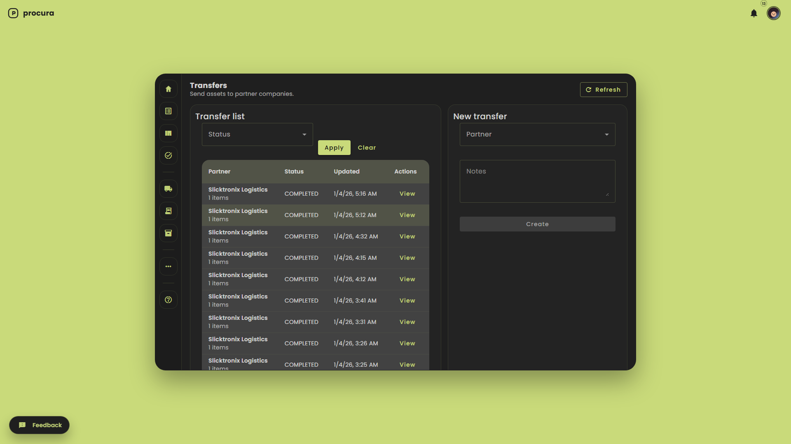

## Bills
_Note: Visible only to users with the procurement role._
1. Open **Bills** and filter by vendor or BOM ID.
2. Use **New bill** to create a bill and link it to a BOM or PO.
3. Open a bill to attach files or update details.

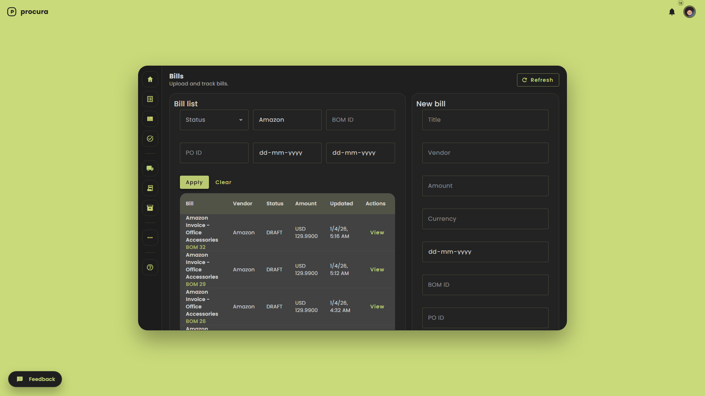

## Attachments
1. Upload files and link them to BOMs, POs, or Bills.
2. Use the list to download or delete attachments.

## Search history
1. Open **Search History** to review saved queries.
2. This list is scoped to the current user.

## Audit log
1. Open **Audit Log** to see recent workflow events.
2. Filter by BOM, actor, or date range when needed.

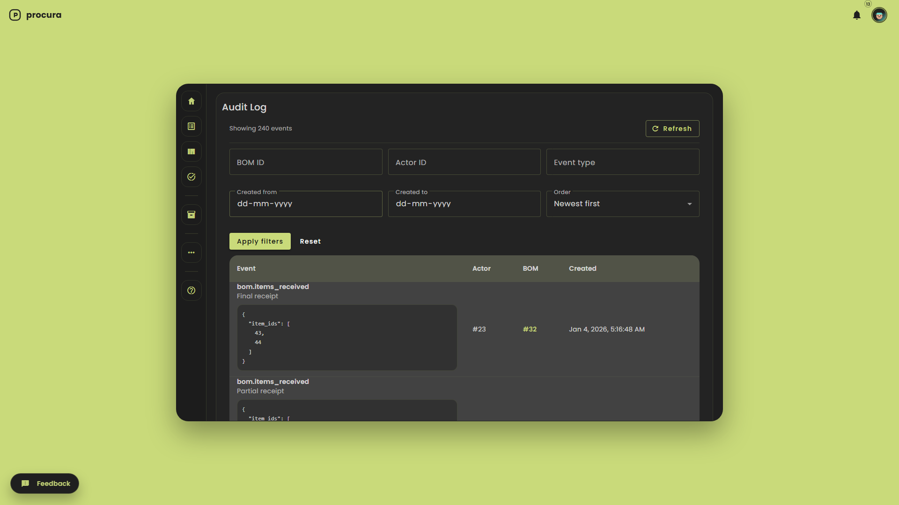

## Notifications
1. Click the bell icon to open notifications.
2. Mark items read or clear all.
3. Toggle email mirroring in **Profile** if enabled.

## Help guide and tutorial
1. Open **Help guide** from the user menu or the More menu.
2. Use **Help - Start tutorial** to launch the guided walkthrough.
3. The tutorial adapts to your role and skips missing UI elements.

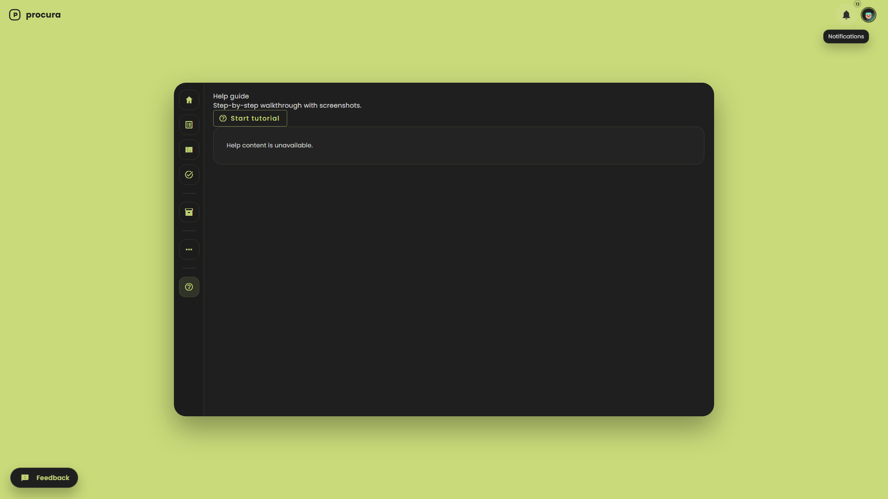

## Feedback
1. Click the **Feedback** button to open the panel.
2. Submit a category, message, and optional rating.
3. Admins can review status updates in the same panel.

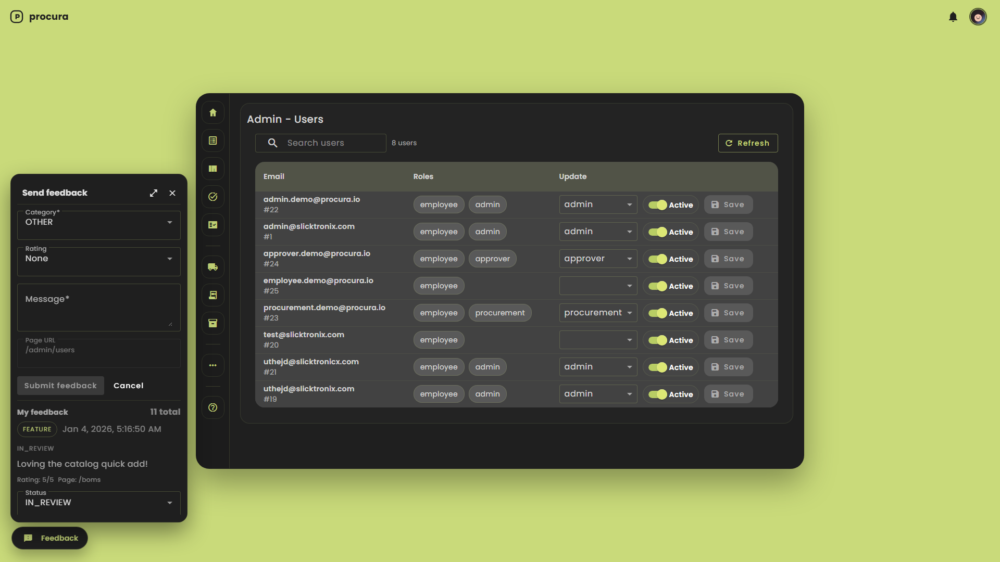

## Profile + admin
1. Update display name, job title, and notification preferences in **Profile**.
2. Admins manage roles and activation in **Admin Users**.

